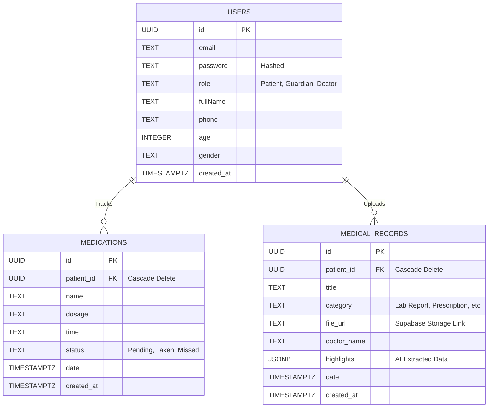

# CareSync - Technical Documentation & Database Schema

## 1. System Architecture
CareSync is a privacy-first, offline-capable healthcare web application designed with an API-first approach using Next.js.
- **Frontend Framework**: Next.js (React)
- **Styling**: Vanilla CSS Modules (dynamic theming based on risk logic)
- **Backend Infrastructure**: Next.js Route Handlers (Serverless APIs) + Node.js
- **Primary Database**: Supabase (PostgreSQL)
- **Storage**: Supabase Storage Buckets (for Medical Report uploads)
- **Authentication Strategy**: Custom implementation using JWT (`jose`) and secure hashing (`bcryptjs`) to allow for offline-first scalability that isn't locked into Auth providers. 

## 2. API Structure Documentation

### `POST /api/auth/register`
- Registers a new user. Expects `email`, `password`, `role`, `fullName` in the body. Hashes the password via bcrypt and returns a JSON payload containing the user ID on success.

### `POST /api/auth/login`
- Authenticates a user. Expects `email`, `password`. If successful, generates an HttpOnly JWT cookie and returns standard user data.

### `GET /api/auth/me`
- Verifies the JWT and securely returns the current user's profile metadata based on the `patient_id`. 

### `GET & POST /api/medicines`
- **GET**: Reads data for the current user and returns an array of `medications`, sorted chronologically. Used for the real-time Dashboard analytics engine (Adherence & Risk calculations).
- **POST**: Accepts `name`, `dosage`, and `time` to insert a new pending medication for the logged-in user.

### `PATCH /api/medicines/[id]`
- Modifies individual medication status (e.g. toggles between 'Pending' and 'Taken'). Essential for adherence tracking.

### `GET & POST /api/records`
- **GET**: Retrieves uploaded medical records from the `medical_records` table, containing highlights and Supabase Storage `file_url`.
- **POST**: Fully integrated multipart/form-data handler. Uploads a document to the `reports` bucket, generates a public URL, processes an AI-Assisted Highlight summary based on the document properties, and stores the structured JSON.

### `POST /api/chat`
- The Mental Health chatbot endpoint. Interprets user input (NLP rules engine for hackathon, scalable to Gemini API) to detect stress, self-harm keywords, or clinical queries, providing safe conversational responses without issuing diagnosis.

---

## 3. Entity-Relationship (ER) Diagram
*Since Markdown does not support native graphical ER diagrams, below is a MermaidJS representation of the PostgreSQL schema relationships. You can paste this code block directly into [Mermaid Live](https://mermaid.live/) to generate a beautiful diagram for your pitch.*

## 4. Scalability Plan & Technical Roadmap

**Phase 1 (Complete):** Auth routing, Centralized Record Storage, Medicine Reminders, Analytics Adherence logic, Mock AI Highlighting, and Chatbot framework.

**Phase 2 (Scalability transition):** 
- Integrate true OCR via Google ML Kit inside the `POST /api/records` route instead of relying on title-based mocks. 
- Upgrade `/api/chat` from the rule-based Engine to the actual Gemini REST API or Vertex AI endpoint.
- Add real Web Push Notifications and Service Workers via the Next.js `next-pwa` plugin to enable the "offline-first" reminders feature.
